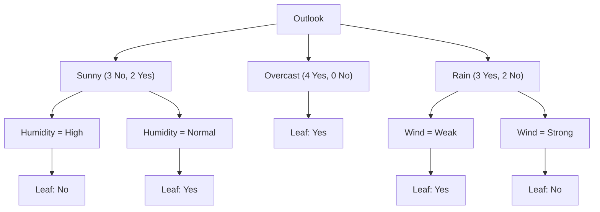
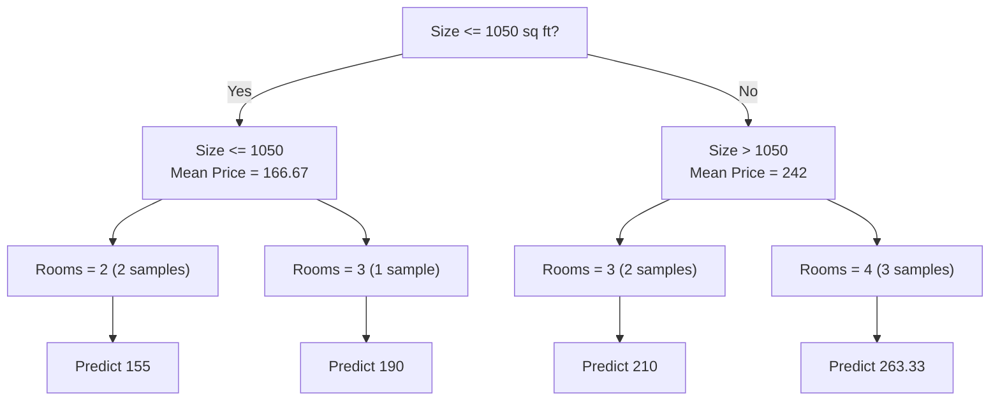
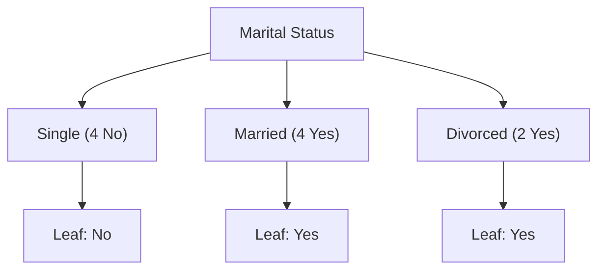

A **Decision Tree** is a powerful and intuitive supervised machine learning algorithm that can be used for both **classification** and **regression** tasks. It's essentially a flowchart-like structure where each internal node represents a "test" on an attribute (a feature of your data), each branch represents the outcome of that test, and each leaf node (or terminal node) represents a class label (in classification) or a predicted numerical value (in regression).

Think of it like a series of "if-then-else" rules that are automatically learned from your data.

Here's a breakdown of the key concepts:

**1. Tree Structure:**

* **Root Node:** This is the starting point of the decision tree. It represents the entire dataset and the first decision or test that will be applied.
* **Internal Nodes (Decision Nodes):** These nodes represent a test on a specific attribute. Based on the outcome of this test, the data is split into different subsets, and you traverse down a particular branch. For example, "Is the temperature > 25°C?".
* **Branches:** These are the lines connecting the nodes and represent the possible outcomes of a test or decision.
* **Leaf Nodes (Terminal Nodes):** These are the final nodes in the tree, representing the predicted outcome (e.g., "Yes, go outside" for classification, or "Price will be $300,000" for regression). They don't split any further.

**2. How it Works (The Learning Process):**

Decision trees are built using a process called **recursive partitioning** or "divide and conquer." The goal is to create homogeneous subsets of data at each step, meaning that data points within a leaf node are as similar as possible in terms of their target variable.

The algorithm works top-down, repeatedly splitting the data based on the attribute that provides the "best" split. "Best" is determined by metrics that measure the **homogeneity** or **purity** of the resulting subsets. Common metrics include:

* **Information Gain (ID3, C4.5):** Measures the reduction in entropy (a measure of impurity or disorder) after a split. The attribute with the highest information gain is chosen for splitting.
* **Gini Impurity (CART):** Measures how often a randomly chosen element from the set would be incorrectly labeled if it were randomly labeled according to the distribution of labels in the subset. A lower Gini impurity indicates a more pure subset.

The splitting process continues until:

* All data points in a node belong to the same class (for classification) or have a very similar value (for regression).
* No further useful splits can be made.
* A pre-defined stopping criterion is met (e.g., maximum tree depth, minimum number of samples per leaf).

**3. Types of Decision Trees:**

* **Classification Trees:** Used when the target variable is categorical (e.g., "yes/no," "spam/not spam," "disease A/disease B/no disease"). The leaf nodes represent class labels.
* **Regression Trees:** Used when the target variable is continuous (e.g., predicting house prices, stock values, or a patient's length of stay in a hospital). The leaf nodes represent numerical values, often the average of the target variable for the data points in that leaf.

**4. Advantages of Decision Trees:**

* **Easy to Understand and Interpret:** The tree-like structure makes them highly visual and intuitive, even for non-technical users. You can literally follow the path of decisions.
* **Handles Both Numerical and Categorical Data:** They can work with various types of data without extensive preprocessing.
* **Requires Little Data Preparation:** Unlike some algorithms, they don't necessarily require data normalization or scaling.
* **White Box Model:** The reasoning behind a prediction is transparent and easily explainable, as you can see the decision path.
* **Can Handle Multi-Output Problems:** They can predict multiple target variables simultaneously.

**5. Disadvantages and Considerations:**

* **Prone to Overfitting:** Without proper control, decision trees can become very complex and fit the training data too closely, leading to poor performance on unseen data. Techniques like **pruning** (removing less important branches) and setting hyperparameter limits (e.g., `max_depth`) are used to combat this.
* **Instability:** Small changes in the training data can lead to a completely different tree structure.
* **Bias towards Dominant Classes:** In imbalanced datasets, decision trees can be biased towards the majority class.
* **Greedy Approach:** The algorithm makes locally optimal decisions at each split, which doesn't guarantee a globally optimal tree.

**In summary**, a Decision Tree is a powerful and interpretable machine learning algorithm that mimics human decision-making by creating a series of rules based on data features, leading to a prediction or classification.

---
Let's delve into the mathematical equations behind the core concepts of Decision Trees, focusing on the most common algorithms: ID3/C4.5 (using Information Gain/Entropy) and CART (using Gini Impurity).

### 1. Entropy (Used in ID3 and C4.5 for Information Gain)

Entropy is a measure of the impurity or disorder in a set of data. In the context of classification, it quantifies the uncertainty in predicting the class label of a random sample. 
- A perfectly pure set (all samples belong to the same class) has an entropy of 0. 
- A set with maximum impurity (samples are evenly distributed among classes) has a higher entropy.

For a dataset $S$ with $c$ distinct classes, the entropy is calculated as:

$$\text{Entropy}(S) = - \sum_{i=1}^{c} p_i \log_2(p_i)$$

Where:
* $S$: The dataset (or a subset of data at a node).
* $c$: The number of unique classes in $S$.
* $p_i$: The proportion of samples in $S$ that belong to class $i$. ($p_i = \frac{\text{Number of samples in class } i}{\text{Total number of samples in } S}$)

**Example:**
If a node has 10 samples: 6 are "Yes" and 4 are "No".
$p_{\text{Yes}} = \frac{6}{10} = 0.6$
$p_{\text{No}} = \frac{4}{10} = 0.4$
$\text{Entropy}(S) = - (0.6 \log_2(0.6) + 0.4 \log_2(0.4))$
$\text{Entropy}(S) \approx - (0.6 \times -0.737 + 0.4 \times -1.322)$
$\text{Entropy}(S) \approx - (-0.4422 - 0.5288)$
$\text{Entropy}(S) \approx 0.971$

### 2. Information Gain (Used in ID3 and C4.5)

Information Gain is the reduction in entropy achieved by splitting the dataset $S$ on a particular attribute $A$. The goal of the decision tree algorithm (like ID3 or C4.5) is to choose the attribute that yields the highest information gain for splitting at each node.

$$\text{Gain}(S, A) = \text{Entropy}(S) - \sum_{v \in \text{Values}(A)} \frac{|S_v|}{|S|} \text{Entropy}(S_v)$$

Where:
* $\text{Gain}(S, A)$: The information gain of splitting dataset $S$ on attribute $A$.
* $\text{Entropy}(S)$: The entropy of the original dataset $S$.
* $\text{Values}(A)$: The set of all possible values for attribute $A$.
* $S_v$: The subset of $S$ for which attribute $A$ has value $v$.
* $|S_v|$: The number of samples in subset $S_v$.
* $|S|$: The total number of samples in dataset $S$.

**How it works:**
The term $\sum_{v \in \text{Values}(A)} \frac{|S_v|}{|S|} \text{Entropy}(S_v)$ represents the **weighted average entropy of the subsets** created after splitting on attribute $A$. The weight $\frac{|S_v|}{|S|}$ accounts for the proportion of samples in each subset.

By subtracting this weighted average from the original entropy, we measure how much the overall uncertainty has been reduced by performing the split. A higher information gain means a better split.

### 3. Gini Impurity (Used in CART - Classification And Regression Trees)

Gini Impurity is another common metric used to measure the impurity of a node, particularly in the CART algorithm. It measures the probability of misclassifying a randomly chosen element in the dataset if it were randomly labeled according to the class distribution in the subset. A Gini impurity of 0 means the node is perfectly pure (all samples belong to the same class).

For a dataset $S$ with $c$ distinct classes, the Gini impurity is calculated as:

$$\text{Gini}(S) = 1 - \sum_{i=1}^{c} p_i^2$$

Where:
* $S$: The dataset (or a subset of data at a node).
* $c$: The number of unique classes in $S$.
* $p_i$: The proportion of samples in $S$ that belong to class $i$.

**Example:**
If a node has 10 samples: 6 are "Yes" and 4 are "No".
$p_{\text{Yes}} = 0.6$
$p_{\text{No}} = 0.4$
$\text{Gini}(S) = 1 - (0.6^2 + 0.4^2)$
$\text{Gini}(S) = 1 - (0.36 + 0.16)$
$\text{Gini}(S) = 1 - 0.52$
$\text{Gini}(S) = 0.48$

### 4. Gini Gain (Used in CART)

Similar to Information Gain, Gini Gain (or simply the reduction in Gini Impurity) is used to determine the best split in the CART algorithm. The attribute split that results in the largest decrease in Gini impurity is chosen.

$$\text{Gini Gain}(S, A) = \text{Gini}(S) - \sum_{v \in \text{Values}(A)} \frac{|S_v|}{|S|} \text{Gini}(S_v)$$

This formula is structurally very similar to Information Gain, but it uses Gini impurity instead of entropy. The goal is to maximize this gain.

### 5. Mean Squared Error (MSE) - (Used in Regression Trees)

When building a Regression Tree, the goal is to predict a continuous numerical value. Instead of purity metrics for classification, regression trees use metrics that measure the error or variance of the target variable within a node. The most common metric is Mean Squared Error (MSE).

For a node $S$ containing $N$ samples with target values $y_1, y_2, \ldots, y_N$, the MSE is calculated as:

$$\text{MSE}(S) = \frac{1}{N} \sum_{i=1}^{N} (y_i - \bar{y})^2$$

Where:
* $N$: The number of samples in the node $S$.
* $y_i$: The actual target value for the $i$-th sample.
* $\bar{y}$: The mean (average) of the target values in node $S$. ($\bar{y} = \frac{1}{N} \sum_{i=1}^{N} y_i$)

**How it works in Splitting:**
When deciding on a split for a regression tree, the algorithm aims to minimize the sum of MSEs of the resulting child nodes. It tries to create child nodes where the target values are as close as possible to their respective means.

The reduction in MSE (similar to gain) after splitting on attribute $A$ would be:

$$\text{Reduction in MSE}(S, A) = \text{MSE}(S) - \sum_{v \in \text{Values}(A)} \frac{|S_v|}{|S|} \text{MSE}(S_v)$$

The attribute that maximizes this reduction (or minimizes the weighted average of child MSEs) is chosen for the split.

These are the fundamental mathematical equations that drive the construction of decision trees, allowing them to effectively partition data and make predictions.

---

### Examples
Let's walk through a dummy example of how a Decision Tree is built for a **classification problem** using the **Information Gain (Entropy)** criterion.

**Scenario:** We want to decide if we should **"Go Outside"** based on the weather conditions.

**Our Dummy Dataset:**

| Outlook    | Temperature | Humidity | Wind     | Go Outside? (Target) |
|------------|-------------|----------|----------|----------------------|
| Sunny      | Hot         | High     | Weak     | No                   |
| Sunny      | Hot         | High     | Strong   | No                   |
| Overcast   | Hot         | High     | Weak     | Yes                  |
| Rain       | Mild        | High     | Weak     | Yes                  |
| Rain       | Cool        | Normal   | Weak     | Yes                  |
| Rain       | Cool        | Normal   | Strong   | No                   |
| Overcast   | Cool        | Normal   | Strong   | Yes                  |
| Sunny      | Mild        | High     | Weak     | No                   |
| Sunny      | Cool        | Normal   | Weak     | Yes                  |
| Rain       | Mild        | Normal   | Weak     | Yes                  |
| Sunny      | Mild        | Normal   | Strong   | Yes                  |
| Overcast   | Mild        | High     | Strong   | Yes                  |
| Overcast   | Hot         | Normal   | Weak     | Yes                  |
| Rain       | Mild        | High     | Strong   | No                   |

Total Samples = 14
"Yes" count = 9
"No" count = 5

---

**Step 1: Calculate the Entropy of the Root Node (Initial Dataset)**

* Total samples = 14
* $P(\text{Yes}) = \frac{9}{14}$
* $P(\text{No}) = \frac{5}{14}$

$\text{Entropy}(\text{S}) = - (\frac{9}{14} \log_2(\frac{9}{14}) + \frac{5}{14} \log_2(\frac{5}{14}))$
$\text{Entropy}(\text{S}) \approx - (0.643 \times -0.635 + 0.357 \times -1.485)$
$\text{Entropy}(\text{S}) \approx - (-0.408 + -0.530)$
$\text{Entropy}(\text{S}) \approx \mathbf{0.938}$

---

**Step 2: Calculate Information Gain for Each Attribute**

We'll calculate the Information Gain for each attribute to determine the best initial split.

**Attribute: Outlook**

* **Outlook = Sunny:** 5 samples (3 No, 2 Yes)
    * $\text{Entropy}(\text{Sunny}) = - (\frac{3}{5} \log_2(\frac{3}{5}) + \frac{2}{5} \log_2(\frac{2}{5}))$
    * $\text{Entropy}(\text{Sunny}) \approx - (0.6 \times -0.737 + 0.4 \times -1.322) \approx 0.971$
* **Outlook = Overcast:** 4 samples (4 Yes, 0 No) - **Pure Node!**
    * $\text{Entropy}(\text{Overcast}) = - (\frac{4}{4} \log_2(\frac{4}{4}) + \frac{0}{4} \log_2(\frac{0}{4})) = 0$
* **Outlook = Rain:** 5 samples (3 Yes, 2 No)
    * $\text{Entropy}(\text{Rain}) = - (\frac{3}{5} \log_2(\frac{3}{5}) + \frac{2}{5} \log_2(\frac{2}{5})) \approx 0.971$

Now, calculate Gain for Outlook:
$\text{Gain}(\text{S, Outlook}) = \text{Entropy}(\text{S}) - \left[ \frac{5}{14} \text{Entropy}(\text{Sunny}) + \frac{4}{14} \text{Entropy}(\text{Overcast}) + \frac{5}{14} \text{Entropy}(\text{Rain}) \right]$
$\text{Gain}(\text{S, Outlook}) = 0.938 - \left[ \frac{5}{14}(0.971) + \frac{4}{14}(0) + \frac{5}{14}(0.971) \right]$
$\text{Gain}(\text{S, Outlook}) = 0.938 - \left[ 0.347 + 0 + 0.347 \right]$
$\text{Gain}(\text{S, Outlook}) = 0.938 - 0.694 = \mathbf{0.244}$

**Attribute: Temperature**
(You'd do similar calculations for Temperature, Humidity, and Wind. Let's just state the results for brevity, but you'd go through the full entropy calculations for each branch as above.)

* **Temperature = Hot:** 4 samples (2 No, 2 Yes) -> Entropy(Hot) = 1.0
* **Temperature = Mild:** 6 samples (2 No, 4 Yes) -> Entropy(Mild) = 0.918
* **Temperature = Cool:** 4 samples (1 No, 3 Yes) -> Entropy(Cool) = 0.811

$\text{Gain}(\text{S, Temperature}) = \text{Entropy}(\text{S}) - \left[ \frac{4}{14} \text{Entropy}(\text{Hot}) + \frac{6}{14} \text{Entropy}(\text{Mild}) + \frac{4}{14} \text{Entropy}(\text{Cool}) \right]$
$\text{Gain}(\text{S, Temperature}) = 0.938 - \left[ \frac{4}{14}(1.0) + \frac{6}{14}(0.918) + \frac{4}{14}(0.811) \right]$
$\text{Gain}(\text{S, Temperature}) = 0.938 - [0.286 + 0.393 + 0.232] = 0.938 - 0.911 = \mathbf{0.027}$

**Attribute: Humidity**

* **Humidity = High:** 7 samples (4 No, 3 Yes) -> Entropy(High) = 0.985
* **Humidity = Normal:** 7 samples (1 No, 6 Yes) -> Entropy(Normal) = 0.592

$\text{Gain}(\text{S, Humidity}) = \text{Entropy}(\text{S}) - \left[ \frac{7}{14} \text{Entropy}(\text{High}) + \frac{7}{14} \text{Entropy}(\text{Normal}) \right]$
$\text{Gain}(\text{S, Humidity}) = 0.938 - \left[ 0.5(0.985) + 0.5(0.592) \right]$
$\text{Gain}(\text{S, Humidity}) = 0.938 - [0.493 + 0.296] = 0.938 - 0.789 = \mathbf{0.149}$

**Attribute: Wind**

* **Wind = Weak:** 8 samples (2 No, 6 Yes) -> Entropy(Weak) = 0.811
* **Wind = Strong:** 6 samples (3 No, 3 Yes) -> Entropy(Strong) = 1.0

$\text{Gain}(\text{S, Wind}) = \text{Entropy}(\text{S}) - \left[ \frac{8}{14} \text{Entropy}(\text{Weak}) + \frac{6}{14} \text{Entropy}(\text{Strong}) \right]$
$\text{Gain}(\text{S, Wind}) = 0.938 - \left[ \frac{8}{14}(0.811) + \frac{6}{14}(1.0) \right]$
$\text{Gain}(\text{S, Wind}) = 0.938 - [0.463 + 0.429] = 0.938 - 0.892 = \mathbf{0.046}$

---

**Step 3: Choose the Best Split**

Comparing the Information Gains:

* Outlook: 0.244
* Temperature: 0.027
* Humidity: 0.149
* Wind: 0.046

**"Outlook" has the highest Information Gain (0.244). So, "Outlook" becomes the root node.**

---

**Step 4: Create Branches and Recursively Build Subtrees**

Now, we split the dataset based on the "Outlook" attribute:

**Branch 1: Outlook = Overcast**

| Outlook    | Temperature | Humidity | Wind     | Go Outside? (Target) |
|------------|-------------|----------|----------|----------------------|
| Overcast   | Hot         | High     | Weak     | Yes                  |
| Overcast   | Cool        | Normal   | Strong   | Yes                  |
| Overcast   | Mild        | High     | Strong   | Yes                  |
| Overcast   | Hot         | Normal   | Weak     | Yes                  |

* All 4 samples are "Yes".
* Entropy = 0 (perfectly pure).
* **Leaf Node: "Yes"**

**Branch 2: Outlook = Sunny**

| Outlook    | Temperature | Humidity | Wind     | Go Outside? (Target) |
|------------|-------------|----------|----------|----------------------|
| Sunny      | Hot         | High     | Weak     | No                   |
| Sunny      | Hot         | High     | Strong   | No                   |
| Sunny      | Mild        | High     | Weak     | No                   |
| Sunny      | Cool        | Normal   | Weak     | Yes                  |
| Sunny      | Mild        | Normal   | Strong   | Yes                  |

* 5 samples (3 No, 2 Yes). Entropy = 0.971. This node is not pure, so we need to split further.
* Now, we repeat the process: calculate Information Gain for the remaining attributes (Temperature, Humidity, Wind) *only for this subset of data*.

    * **Humidity:**
        * High: 3 samples (3 No, 0 Yes) -> Entropy = 0 (Pure "No")
        * Normal: 2 samples (0 No, 2 Yes) -> Entropy = 0 (Pure "Yes")
        * Gain(Sunny, Humidity) = 0.971 - [3/5 * 0 + 2/5 * 0] = **0.971** (This is the highest possible gain, meaning humidity perfectly separates this subset)

    * (You'd calculate for Temperature and Wind as well, but Humidity will turn out to be the best for this subset).

* So, for the "Sunny" branch, we split by **"Humidity"**:
    * If **Humidity = High** (under Sunny Outlook): **Leaf Node: "No"** (All 3 samples are "No")
    * If **Humidity = Normal** (under Sunny Outlook): **Leaf Node: "Yes"** (All 2 samples are "Yes")

**Branch 3: Outlook = Rain**

| Outlook    | Temperature | Humidity | Wind     | Go Outside? (Target) |
|------------|-------------|----------|----------|----------------------|
| Rain       | Mild        | High     | Weak     | Yes                  |
| Rain       | Cool        | Normal   | Weak     | Yes                  |
| Rain       | Cool        | Normal   | Strong   | No                   |
| Rain       | Mild        | Normal   | Weak     | Yes                  |
| Rain       | Mild        | High     | Strong   | No                   |

* 5 samples (3 Yes, 2 No). Entropy = 0.971. Not pure.
* Again, calculate Information Gain for remaining attributes (Temperature, Humidity, Wind) *only for this subset*.

    * **Wind:**
        * Weak: 3 samples (3 Yes, 0 No) -> Entropy = 0 (Pure "Yes")
        * Strong: 2 samples (0 Yes, 2 No) -> Entropy = 0 (Pure "No")
        * Gain(Rain, Wind) = 0.971 - [3/5 * 0 + 2/5 * 0] = **0.971**

* So, for the "Rain" branch, we split by **"Wind"**:
    * If **Wind = Weak** (under Rain Outlook): **Leaf Node: "Yes"** (All 3 samples are "Yes")
    * If **Wind = Strong** (under Rain Outlook): **Leaf Node: "No"** (All 2 samples are "No")

---

**The Final Decision Tree (Simplified Visual):**

**How to make a prediction:**

Let's say we have a new instance: `Outlook = Sunny, Temperature = Cool, Humidity = High, Wind = Weak`

1.  Start at the root: `Outlook`
2.  Follow the `Sunny` branch.
3.  Next node is `Humidity`.
4.  Follow the `Humidity = High` branch.
5.  Reach a Leaf Node: **"No"** (So, don't go outside).

This example demonstrates the recursive nature of decision tree building, where at each step, the algorithm chooses the best attribute to split the data to maximize the purity of the resulting subsets, until all paths lead to a pure leaf node or a stopping criterion is met.

---

Now Let's illustrate the working of a Decision Tree for a **regression problem** using the **Mean Squared Error (MSE)** criterion.

**Scenario:** We want to predict the **"Price"** of a small house based on its "Size" and "Number of Rooms".

**Our Dummy Dataset:**

| Size (sq ft) | Number of Rooms | Price (in thousands USD) (Target) |
|--------------|-----------------|-----------------------------------|
| 800          | 2               | 150                               |
| 900          | 2               | 160                               |
| 1000         | 3               | 190                               |
| 1100         | 3               | 200                               |
| 1200         | 3               | 220                               |
| 1300         | 4               | 250                               |
| 1400         | 4               | 260                               |
| 1500         | 4               | 280                               |

Total Samples = 8

---

**Step 1: Calculate the Mean Squared Error (MSE) of the Root Node (Initial Dataset)**

* Target Prices: [150, 160, 190, 200, 220, 250, 260, 280]
* Mean Price ($\bar{y}$) = $\frac{150+160+190+200+220+250+260+280}{8} = \frac{1710}{8} = 213.75$

$\text{MSE}(\text{S}) = \frac{1}{N} \sum_{i=1}^{N} (y_i - \bar{y})^2$
$\text{MSE}(\text{S}) = \frac{1}{8} [ (150-213.75)^2 + (160-213.75)^2 + (190-213.75)^2 + (200-213.75)^2 + (220-213.75)^2 + (250-213.75)^2 + (260-213.75)^2 + (280-213.75)^2 ]$
$\text{MSE}(\text{S}) = \frac{1}{8} [ (-63.75)^2 + (-53.75)^2 + (-23.75)^2 + (-13.75)^2 + (6.25)^2 + (36.25)^2 + (46.25)^2 + (66.25)^2 ]$
$\text{MSE}(\text{S}) = \frac{1}{8} [ 4064.06 + 2889.06 + 564.06 + 189.06 + 39.06 + 1314.06 + 2139.06 + 4389.06 ]$
$\text{MSE}(\text{S}) = \frac{1}{8} [15688.48] = \mathbf{1961.06}$ (approx)

---

**Step 2: Evaluate Potential Splits for Each Attribute**

For regression trees, we evaluate splits based on how much they *reduce* the overall MSE. For continuous features like "Size," we consider various split points (e.g., the midpoint between sorted unique values). For categorical features like "Number of Rooms," each unique value is a potential split.

We want to find the split that results in the lowest combined (weighted average) MSE of the child nodes.

**Attribute: Number of Rooms**

This is a categorical feature with values 2, 3, 4. We can test splits like `Rooms <= 2`, `Rooms <= 3`, etc.
Let's consider two splits for simplicity: `Rooms <= 2.5` and `Rooms <= 3.5`.

**Split 1: `Number of Rooms <= 2.5`** (This separates 2 rooms from 3 and 4 rooms)

* **Left Child (Rooms = 2):** Samples [150, 160]
    * Mean Price = $(150+160)/2 = 155$
    * $\text{MSE}(\text{Left}) = \frac{1}{2} [ (150-155)^2 + (160-155)^2 ] = \frac{1}{2} [ (-5)^2 + (5)^2 ] = \frac{1}{2} [ 25 + 25 ] = \mathbf{25}$
* **Right Child (Rooms = 3 or 4):** Samples [190, 200, 220, 250, 260, 280]
    * Mean Price = $(190+200+220+250+260+280)/6 = 230$
    * $\text{MSE}(\text{Right}) = \frac{1}{6} [ (190-230)^2 + (200-230)^2 + (220-230)^2 + (250-230)^2 + (260-230)^2 + (280-230)^2 ]$
    * $\text{MSE}(\text{Right}) = \frac{1}{6} [ (-40)^2 + (-30)^2 + (-10)^2 + (20)^2 + (30)^2 + (50)^2 ]$
    * $\text{MSE}(\text{Right}) = \frac{1}{6} [ 1600 + 900 + 100 + 400 + 900 + 2500 ] = \frac{1}{6} [ 6400 ] = \mathbf{1066.67}$

* **Weighted Average MSE for `Rooms <= 2.5`:**
    * $\frac{2}{8} \times \text{MSE}(\text{Left}) + \frac{6}{8} \times \text{MSE}(\text{Right})$
    * $= \frac{2}{8}(25) + \frac{6}{8}(1066.67) = 6.25 + 800 = \mathbf{806.25}$

**Attribute: Size (sq ft)**

We need to consider potential split points. A common approach is to take the average of consecutive sorted unique values.
Sorted unique sizes: [800, 900, 1000, 1100, 1200, 1300, 1400, 1500]
Potential split points: 850, 950, 1050, 1150, 1250, 1350, 1450.

Let's test **Split 2: `Size <= 1050 sq ft`**

* **Left Child (Size <= 1050):** Samples [800 (150), 900 (160), 1000 (190)]
    * Mean Price = $(150+160+190)/3 = 500/3 \approx 166.67$
    * $\text{MSE}(\text{Left}) = \frac{1}{3} [ (150-166.67)^2 + (160-166.67)^2 + (190-166.67)^2 ]$
    * $\text{MSE}(\text{Left}) = \frac{1}{3} [ (-16.67)^2 + (-6.67)^2 + (23.33)^2 ] = \frac{1}{3} [ 277.89 + 44.49 + 544.29 ] = \frac{1}{3} [ 866.67 ] = \mathbf{288.89}$
* **Right Child (Size > 1050):** Samples [1100 (200), 1200 (220), 1300 (250), 1400 (260), 1500 (280)]
    * Mean Price = $(200+220+250+260+280)/5 = 1210/5 = 242$
    * $\text{MSE}(\text{Right}) = \frac{1}{5} [ (200-242)^2 + (220-242)^2 + (250-242)^2 + (260-242)^2 + (280-242)^2 ]$
    * $\text{MSE}(\text{Right}) = \frac{1}{5} [ (-42)^2 + (-22)^2 + (8)^2 + (18)^2 + (38)^2 ]$
    * $\text{MSE}(\text{Right}) = \frac{1}{5} [ 1764 + 484 + 64 + 324 + 1444 ] = \frac{1}{5} [ 4076 ] = \mathbf{815.2}$

* **Weighted Average MSE for `Size <= 1050 sq ft`:**
    * $\frac{3}{8} \times \text{MSE}(\text{Left}) + \frac{5}{8} \times \text{MSE}(\text{Right})$
    * $= \frac{3}{8}(288.89) + \frac{5}{8}(815.2) = 108.33 + 509.5 = \mathbf{617.83}$

**Comparing Splits:**

* `Number of Rooms <= 2.5`: Weighted Avg MSE = 806.25
* `Size <= 1050 sq ft`: Weighted Avg MSE = 617.83

The split **`Size <= 1050 sq ft`** yields a lower weighted average MSE, making it the better first split.
**Therefore, "Size" becomes the root node, with the split point at 1050 sq ft.**

---

**Step 3: Create Branches and Recursively Build Subtrees**

**Branch 1: Size <= 1050 sq ft**
* Samples: [800 (150), 900 (160), 1000 (190)]
* Mean Price = 166.67
* MSE = 288.89

This node is not pure (MSE > 0), so we need to split further. Only "Number of Rooms" is left as an attribute.

* **Potential Split: `Number of Rooms <= 2.5` (for this subset)**
    * **Left Child (Rooms = 2):** Samples [800 (150), 900 (160)]
        * Mean Price = 155
        * MSE = 25
    * **Right Child (Rooms = 3):** Samples [1000 (190)]
        * Mean Price = 190
        * MSE = 0 (Pure node!)

* **Weighted Average MSE for `Rooms <= 2.5` (for this subset):**
    * $\frac{2}{3}(25) + \frac{1}{3}(0) = 16.67 + 0 = \mathbf{16.67}$

* Since this is the only remaining attribute, we split by `Number of Rooms`.
    * If `Size <= 1050` AND `Rooms = 2`: **Leaf Node: Predict 155**
    * If `Size <= 1050` AND `Rooms = 3`: **Leaf Node: Predict 190**

**Branch 2: Size > 1050 sq ft**
* Samples: [1100 (200), 1200 (220), 1300 (250), 1400 (260), 1500 (280)]
* Mean Price = 242
* MSE = 815.2

This node is also not pure, so we split further by "Number of Rooms".

* **Potential Split: `Number of Rooms <= 3.5` (for this subset)**
    * **Left Child (Rooms = 3):** Samples [1100 (200), 1200 (220)]
        * Mean Price = $(200+220)/2 = 210$
        * MSE = $\frac{1}{2} [ (200-210)^2 + (220-210)^2 ] = \frac{1}{2} [ (-10)^2 + (10)^2 ] = \frac{1}{2} [100+100] = \mathbf{100}$
    * **Right Child (Rooms = 4):** Samples [1300 (250), 1400 (260), 1500 (280)]
        * Mean Price = $(250+260+280)/3 = 790/3 \approx 263.33$
        * MSE = $\frac{1}{3} [ (250-263.33)^2 + (260-263.33)^2 + (280-263.33)^2 ]$
        * MSE = $\frac{1}{3} [ (-13.33)^2 + (-3.33)^2 + (16.67)^2 ] = \frac{1}{3} [ 177.69 + 11.09 + 277.89 ] = \frac{1}{3} [ 466.67 ] = \mathbf{155.56}$

* **Weighted Average MSE for `Rooms <= 3.5` (for this subset):**
    * $\frac{2}{5}(100) + \frac{3}{5}(155.56) = 40 + 93.33 = \mathbf{133.33}$

* We split by `Number of Rooms`.
    * If `Size > 1050` AND `Rooms = 3`: **Leaf Node: Predict 210**
    * If `Size > 1050` AND `Rooms = 4`: **Leaf Node: Predict 263.33**

---

**The Final Regression Decision Tree (Simplified Visual):**

**How to make a prediction for a new house:**

Let's say we want to predict the price of a house with `Size = 1250 sq ft` and `Number of Rooms = 4`.

1.  Start at the root: `Size <= 1050 sq ft?` -> No (1250 is not <= 1050).
2.  Follow the "No" branch (right side).
3.  Next node: `Number of Rooms`.
4.  Follow the `Rooms = 4` branch.
5.  Reach a Leaf Node: **Predict 263.33** (thousand USD).

This example shows how a regression tree partitions the feature space and at each leaf node, predicts the mean (or median) of the target variable for the samples falling into that segment. The splitting continues until a certain level of purity (low MSE) is achieved or a maximum depth is reached.

---
As real-world datasets often contain a mix of categorical and numerical attributes. Decision trees are naturally well-suited to handle both. The key is how the "best split" is determined for each type of attribute.

Let's use a dummy example for a **classification problem** where we predict if a customer will **"Buy a Product"** based on their "Age" (numerical), "Income" (numerical), and "Marital Status" (categorical).

**Scenario:** Predict if a customer will "Buy Product"

**Our Dummy Dataset:**

| Customer ID | Age (Years) | Income (USD) | Marital Status | Buy Product? (Target) |
|-------------|-------------|--------------|----------------|-----------------------|
| 1           | 25          | 40000        | Single         | No                    |
| 2           | 30          | 50000        | Married        | Yes                   |
| 3           | 35          | 60000        | Single         | No                    |
| 4           | 40          | 70000        | Married        | Yes                   |
| 5           | 28          | 45000        | Single         | No                    |
| 6           | 45          | 80000        | Married        | Yes                   |
| 7           | 50          | 90000        | Divorced       | Yes                   |
| 8           | 22          | 35000        | Single         | No                    |
| 9           | 38          | 65000        | Married        | Yes                   |
| 10          | 55          | 95000        | Divorced       | Yes                   |

Total Samples = 10
"Yes" count = 6
"No" count = 4

We'll use **Information Gain (Entropy)** as our splitting criterion.

---

**Step 1: Calculate the Entropy of the Root Node (Initial Dataset)**

* Total samples = 10
* $P(\text{Yes}) = \frac{6}{10} = 0.6$
* $P(\text{No}) = \frac{4}{10} = 0.4$

$\text{Entropy}(\text{S}) = - (0.6 \log_2(0.6) + 0.4 \log_2(0.4))$
$\text{Entropy}(\text{S}) \approx - (0.6 \times -0.737 + 0.4 \times -1.322)$
$\text{Entropy}(\text{S}) \approx - (-0.4422 - 0.5288)$
$\text{Entropy}(\text{S}) \approx \mathbf{0.971}$

---

**Step 2: Calculate Information Gain for Each Attribute**

**A. Categorical Attribute: Marital Status**

* **Marital Status = Single:** 4 samples (4 No, 0 Yes) - **Pure Node!**
    * $\text{Entropy}(\text{Single}) = 0$
* **Marital Status = Married:** 4 samples (0 No, 4 Yes) - **Pure Node!**
    * $\text{Entropy}(\text{Married}) = 0$
* **Marital Status = Divorced:** 2 samples (0 No, 2 Yes) - **Pure Node!**
    * $\text{Entropy}(\text{Divorced}) = 0$

Calculate Gain for Marital Status:
$\text{Gain}(\text{S, Marital Status}) = \text{Entropy}(\text{S}) - \left[ \frac{4}{10} \text{Entropy}(\text{Single}) + \frac{4}{10} \text{Entropy}(\text{Married}) + \frac{2}{10} \text{Entropy}(\text{Divorced}) \right]$
$\text{Gain}(\text{S, Marital Status}) = 0.971 - \left[ \frac{4}{10}(0) + \frac{4}{10}(0) + \frac{2}{10}(0) \right]$
$\text{Gain}(\text{S, Marital Status}) = 0.971 - 0 = \mathbf{0.971}$

**B. Numerical Attribute: Age**

For numerical attributes, we need to find potential split points. A common method is to sort the unique values of the attribute and consider the midpoints between consecutive values as potential split points.

Sorted unique Ages: [22, 25, 28, 30, 35, 38, 40, 45, 50, 55]

Potential split points:
* (22+25)/2 = 23.5
* (25+28)/2 = 26.5
* (28+30)/2 = 29
* (30+35)/2 = 32.5
* (35+38)/2 = 36.5
* (38+40)/2 = 39
* (40+45)/2 = 42.5
* (45+50)/2 = 47.5
* (50+55)/2 = 52.5

We would calculate the Information Gain for *each* of these potential split points and choose the one that yields the highest gain. Let's demonstrate with one promising split, say **Age <= 32.5**.

**Split 1: `Age <= 32.5`**

* **Left Child (Age <= 32.5):** Samples (Customer ID, Age, Income, Marital Status, Buy Product?)
    * (1, 25, 40000, Single, No)
    * (2, 30, 50000, Married, Yes)
    * (5, 28, 45000, Single, No)
    * (8, 22, 35000, Single, No)
    * 4 samples (3 No, 1 Yes)
    * $P(\text{No}) = 3/4 = 0.75$, $P(\text{Yes}) = 1/4 = 0.25$
    * $\text{Entropy}(\text{Age <= 32.5}) = - (0.75 \log_2(0.75) + 0.25 \log_2(0.25))$
    * $\approx - (0.75 \times -0.415 + 0.25 \times -2) \approx - (-0.311 - 0.5) \approx \mathbf{0.811}$

* **Right Child (Age > 32.5):** Samples
    * (3, 35, 60000, Single, No)
    * (4, 40, 70000, Married, Yes)
    * (6, 45, 80000, Married, Yes)
    * (7, 50, 90000, Divorced, Yes)
    * (9, 38, 65000, Married, Yes)
    * (10, 55, 95000, Divorced, Yes)
    * 6 samples (1 No, 5 Yes)
    * $P(\text{No}) = 1/6 \approx 0.167$, $P(\text{Yes}) = 5/6 \approx 0.833$
    * $\text{Entropy}(\text{Age > 32.5}) = - (0.167 \log_2(0.167) + 0.833 \log_2(0.833))$
    * $\approx - (0.167 \times -2.585 + 0.833 \times -0.261) \approx - (-0.432 - 0.218) \approx \mathbf{0.650}$

* **Weighted Average Entropy for `Age <= 32.5` split:**
    * $\frac{4}{10}(0.811) + \frac{6}{10}(0.650) = 0.3244 + 0.39 = 0.7144$

* **Gain(S, Age <= 32.5) =** $\text{Entropy}(\text{S}) - \text{Weighted Avg Entropy}$
    * $= 0.971 - 0.7144 = \mathbf{0.2566}$

**(In a real scenario, you would repeat this for all 9 potential age split points and choose the one with the highest gain.)**

**C. Numerical Attribute: Income**

Sorted unique Incomes: [35000, 40000, 45000, 50000, 60000, 65000, 70000, 80000, 90000, 95000]

Potential split points: 37500, 42500, 47500, 55000, 62500, 67500, 75000, 85000, 92500.

Let's test **Split 2: `Income <= 62500`**

* **Left Child (Income <= 62500):** Samples
    * (1, 25, 40000, Single, No)
    * (2, 30, 50000, Married, Yes)
    * (3, 35, 60000, Single, No)
    * (5, 28, 45000, Single, No)
    * (8, 22, 35000, Single, No)
    * 5 samples (4 No, 1 Yes)
    * $\text{Entropy}(\text{Income <= 62500}) \approx \mathbf{0.811}$ (same as Age <= 32.5 split, due to same class proportions)

* **Right Child (Income > 62500):** Samples
    * (4, 40, 70000, Married, Yes)
    * (6, 45, 80000, Married, Yes)
    * (7, 50, 90000, Divorced, Yes)
    * (9, 38, 65000, Married, Yes)
    * (10, 55, 95000, Divorced, Yes)
    * 5 samples (0 No, 5 Yes) - **Pure Node!**
    * $\text{Entropy}(\text{Income > 62500}) = \mathbf{0}$

* **Weighted Average Entropy for `Income <= 62500` split:**
    * $\frac{5}{10}(0.811) + \frac{5}{10}(0) = 0.4055 + 0 = 0.4055$

* **Gain(S, Income <= 62500) =** $\text{Entropy}(\text{S}) - \text{Weighted Avg Entropy}$
    * $= 0.971 - 0.4055 = \mathbf{0.5655}$

**(Again, you would choose the best split point for Income by testing all of them.)**

---

**Step 3: Choose the Best Split**

Comparing the Information Gains:

* Marital Status: 0.971
* Age (best found so far): 0.2566
* Income (best found so far): 0.5655

**"Marital Status" has the highest Information Gain (0.971). So, "Marital Status" becomes the root node.**

---

**Step 4: Create Branches and Recursively Build Subtrees**

**Branch 1: Marital Status = Single**
* Samples: (1, 25, 40000, Single, No), (3, 35, 60000, Single, No), (5, 28, 45000, Single, No), (8, 22, 35000, Single, No)
* All 4 samples are "No".
* Entropy = 0.
* **Leaf Node: "No"**

**Branch 2: Marital Status = Married**
* Samples: (2, 30, 50000, Married, Yes), (4, 40, 70000, Married, Yes), (6, 45, 80000, Married, Yes), (9, 38, 65000, Married, Yes)
* All 4 samples are "Yes".
* Entropy = 0.
* **Leaf Node: "Yes"**

**Branch 3: Marital Status = Divorced**
* Samples: (7, 50, 90000, Divorced, Yes), (10, 55, 95000, Divorced, Yes)
* All 2 samples are "Yes".
* Entropy = 0.
* **Leaf Node: "Yes"**

---

**The Final Decision Tree (Simplified Visual):**

    
**Observation:** In this particular dummy example, "Marital Status" was so highly correlated with the target variable that it created a perfectly pure tree in just one split. This highlights how effective decision trees can be at finding strong relationships in data.

**If any of the branches (e.g., if "Single" had mixed "Yes" and "No" outcomes) were not pure, the algorithm would recursively apply the same steps:**

1.  Take the subset of data for that branch.
2.  Calculate the entropy of *that subset*.
3.  For *each remaining attribute* (Age, Income in this case), find the best split point (for numerical) or categorical split, and calculate its Information Gain *for that subset*.
4.  Choose the attribute with the highest Information Gain in that subset as the next decision node.
5.  Continue until all nodes are pure or a stopping condition (like max depth or min samples per leaf) is met.

This example clearly demonstrates how a decision tree seamlessly handles both categorical and numerical features by evaluating them based on their ability to reduce impurity (maximize information gain) at each step of the tree building process.